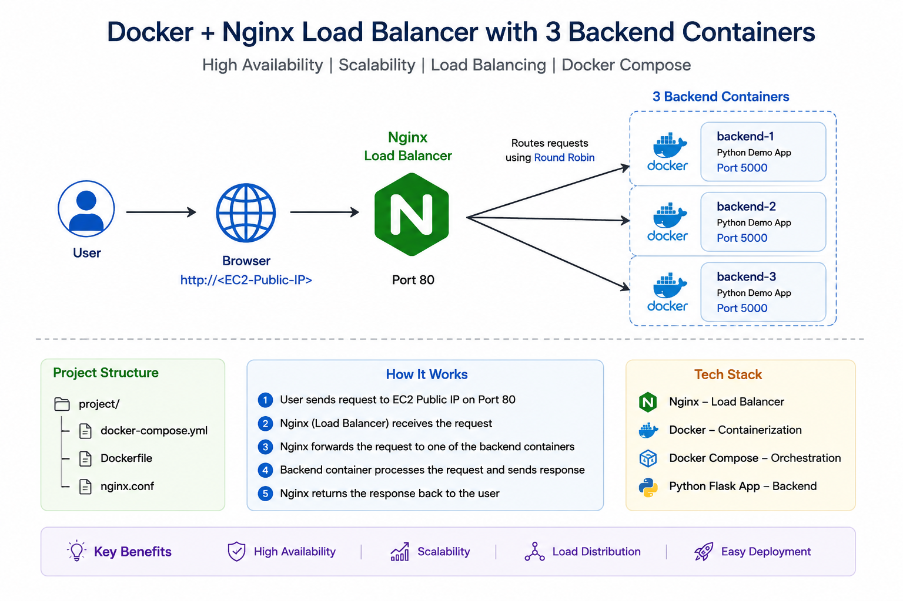

# 🚀 Docker + Nginx Load Balancer with 3 Backend Containers

A simple DevOps project demonstrating **Docker Compose**, **Nginx Load Balancer**, and **3 Python Backend Containers**. Nginx distributes incoming requests across multiple backend containers using the **Round Robin** load balancing algorithm.

---

## 🏗️ Architecture

  

---

## 📌 Project Overview

This project demonstrates how to:

- Deploy multiple backend containers using Docker Compose
- Configure Nginx as a Reverse Proxy and Load Balancer
- Distribute incoming traffic using Round Robin
- Containerize applications using Docker
- Manage multiple containers with Docker Compose

---

## 🛠️ Tech Stack

- Docker
- Docker Compose
- Nginx
- Python Flask Application
- Linux
- 
---

## ⚙️ How It Works

1. User sends a request to the EC2 Public IP.
2. Nginx receives the request on Port 80.
3. Nginx forwards the request to one of the backend containers.
4. Backend container processes the request.
5. Response is returned to the user through Nginx.

---
## Outcome

  

## 🎯 Features

- ✅ Docker Containerization
- ✅ Nginx Reverse Proxy
- ✅ Round Robin Load Balancing
- ✅ Docker Compose Orchestration
- ✅ High Availability
- ✅ Scalable Architecture

---

## 📖 Learning Outcomes

- Docker Image Creation
- Docker Compose
- Container Networking
- Nginx Configuration
- Reverse Proxy
- Load Balancing
- Infrastructure Deployment

---

## 👨‍💻 Author

**Charan Vardhan Katta**

- GitHub: https://github.com/kattacharanvardhan
- LinkedIn: https://linkedin.com/in/charanvardhan
